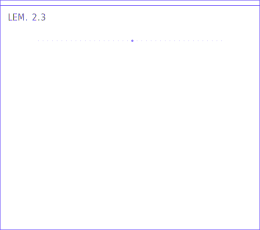

<p align="center">
  
  &nbsp;&nbsp;
  
</p>

<h1 align="center">Lemma</h1>

<p align="center"><strong>Developer Resources</strong></p>

<p align="center">
  SDKs, documentation, and agent skills for setting up Lemma.
</p>

## Start Here

| Resource | Use it for |
| --- | --- |
| [Quickstart](https://docs.uselemma.ai/getting-started/quickstart) | Send your first useful trace to Lemma. |
| [Trace contract](https://docs.uselemma.ai/reference/trace-contract) | Learn the trace shape Lemma expects. |
| [TypeScript SDK](packages/ts/tracing) | Instrument Node and TypeScript applications. |
| [Python SDK](packages/py/tracing) | Instrument Python applications. |
| [Lemma tracing skill](skills/lemma-tracing) | Let a coding agent add tracing for you. |

## Install

TypeScript:

```bash
npm install @uselemma/tracing
```

Python:

```bash
pip install uselemma-tracing
```

Both SDKs read Lemma credentials from environment variables by default:

```bash
export LEMMA_API_KEY=...
export LEMMA_PROJECT_ID=...
```

## Integrations

Lemma includes first-party tracing helpers for common agent stacks:

| Integration | Guide |
| --- | --- |
| Vercel AI SDK | [docs](https://docs.uselemma.ai/integrations/vercel-ai) |
| OpenAI Agents SDK | [docs](https://docs.uselemma.ai/integrations/openai-agents) |
| LangChain | [docs](https://docs.uselemma.ai/integrations/langchain) |
| LangGraph | [docs](https://docs.uselemma.ai/integrations/langgraph) |
| Mastra | [docs](https://docs.uselemma.ai/integrations/mastra) |

For manual instrumentation, start with the [tracing overview](https://docs.uselemma.ai/tracing/overview).

## Repository Layout

| Path | Contents |
| --- | --- |
| [`docs/`](docs) | Mintlify documentation source for [docs.uselemma.ai](https://docs.uselemma.ai). |
| [`packages/ts/tracing`](packages/ts/tracing) | TypeScript SDK package: `@uselemma/tracing`. |
| [`packages/py/tracing`](packages/py/tracing) | Python SDK package: `uselemma-tracing`. |
| [`skills/lemma-tracing`](skills/lemma-tracing) | Lemma tracing skill for coding agents. |

## Development

Install dependencies:

```bash
pnpm install
uv sync
```

Run TypeScript checks:

```bash
pnpm --filter @uselemma/tracing test
pnpm --filter @uselemma/tracing type-check
pnpm --filter @uselemma/tracing build
```

Run Python checks:

```bash
uv run --project packages/py/tracing --extra dev pytest packages/py/tracing/tests
uv build --package uselemma-tracing
```

Validate the docs config:

```bash
python3 -m json.tool docs/docs.json >/dev/null
```

## Releases

Package publishing is driven by package version changes on `main`.

- Changes to `packages/ts/tracing/package.json` publish `@uselemma/tracing`
  when the version is not already present on npm.
- Changes to `packages/py/tracing/pyproject.toml` publish
  `uselemma-tracing` when the version is not already present on PyPI.

## License

MIT
