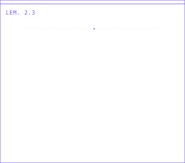

  
  &nbsp;&nbsp;
  

<h1 align="center">Lemma</h1>

<strong>Developer Resources</strong>

  SDKs, documentation, and agent skills for setting up Lemma.

## Start Here

| Resource                                                            | Use it for                                   |
| ------------------------------------------------------------------- | -------------------------------------------- |
| [Quickstart](https://docs.uselemma.ai/tracing/instrumentation/setup) | Send your first useful trace to Lemma.       |
| [Trace contract](https://docs.uselemma.ai/reference/trace-contract) | Learn the trace shape Lemma expects.         |
| [TypeScript SDK](packages/ts/tracing)                               | Instrument Node and TypeScript applications. |
| [Python SDK](packages/py/tracing)                                   | Instrument Python applications.              |
| [Lemma tracing skill](skills/lemma-tracing)                         | Let a coding agent add tracing for you.      |
| [Lemma diagnostics skill](skills/lemma-diagnostics) | Let a coding agent audit traces already in Lemma. |

## Repository Layout

| Path                                           | Contents                                                                        |
| ---------------------------------------------- | ------------------------------------------------------------------------------- |
| [`docs/`](docs)                                | Mintlify documentation source for [docs.uselemma.ai](https://docs.uselemma.ai). |
| [`packages/ts/tracing`](packages/ts/tracing)   | TypeScript SDK package: `@uselemma/tracing`.                                    |
| [`packages/py/tracing`](packages/py/tracing)   | Python SDK package: `uselemma-tracing`.                                         |
| [`skills/lemma-tracing`](skills/lemma-tracing) | Lemma tracing skill for coding agents.                                          |
| [`skills/lemma-diagnostics`](skills/lemma-diagnostics) | Lemma diagnostics skill for coding agents. |
| [`plugins/lemma-codex`](plugins/lemma-codex)   | Local Codex lifecycle-hook tracing plugin.                                      |
| [`plugins/lemma-hermes`](plugins/lemma-hermes) | Hermes Agent plugin with native lifecycle capture and SDK delivery.             |
| [`plugins/lemma-openclaw`](plugins/lemma-openclaw) | OpenClaw plugin with typed hook capture and SDK delivery.                   |
| [`plugins/lemma-opencode`](plugins/lemma-opencode) | OpenCode plugin with native event capture and durable SDK delivery.         |
| [`plugins/lemma-pi`](plugins/lemma-pi)         | Pi package with SDK telemetry and native lifecycle adapters.                    |

## Development

See [CONTRIBUTING.md](CONTRIBUTING.md#development).

## Contributing

See [CONTRIBUTING.md](CONTRIBUTING.md).

Thanks goes to these wonderful people ([emoji key](https://allcontributors.org/docs/en/emoji-key)):

<!-- ALL-CONTRIBUTORS-LIST:START - Do not remove or modify this section -->
<!-- prettier-ignore-start -->
<!-- markdownlint-disable -->
<table>
  <tbody>
    <tr>
      <td align="center" valign="top" width="14.28%"><a href="https://colegaw.in/"> <b>Cole Gawin</b></a> <a href="https://github.com/uselemma/lemma/commits?author=chroline" title="Code">💻</a> <a href="https://github.com/uselemma/lemma/commits?author=chroline" title="Documentation">📖</a> <a href="#maintenance-chroline" title="Maintenance">🚧</a></td>
      <td align="center" valign="top" width="14.28%"><a href="https://github.com/rayshineeeee"> <b>rayshineeeee</b></a> <a href="https://github.com/uselemma/lemma/commits?author=rayshineeeee" title="Code">💻</a></td>
      <td align="center" valign="top" width="14.28%"><a href="https://github.com/Jacopos311"> <b>Jacopos311</b></a> <a href="https://github.com/uselemma/lemma/commits?author=Jacopos311" title="Code">💻</a></td>
      <td align="center" valign="top" width="14.28%"><a href="https://raphael-khalid.vercel.app/"> <b>Raphael</b></a> <a href="https://github.com/uselemma/lemma/commits?author=RaphaelKhalid" title="Code">💻</a></td>
    </tr>
  </tbody>
  <tfoot>
    <tr>
      <td align="center" size="13px" colspan="7">
        
          <a href="https://all-contributors.js.org/docs/en/bot/usage">Add your contributions</a>
        </img>
      </td>
    </tr>
  </tfoot>
</table>

<!-- markdownlint-restore -->
<!-- prettier-ignore-end -->

<!-- ALL-CONTRIBUTORS-LIST:END -->

This project follows the [all-contributors](https://github.com/all-contributors/all-contributors) specification. Contributions of any kind welcome!

## License

MIT
